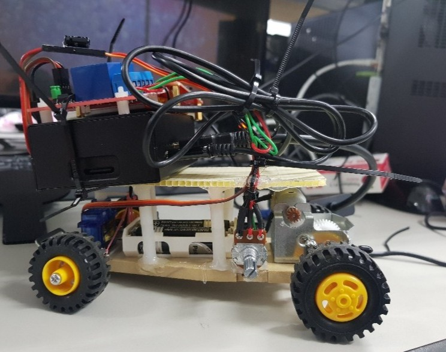
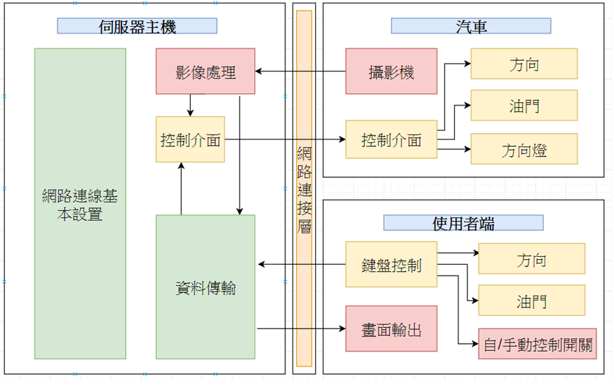
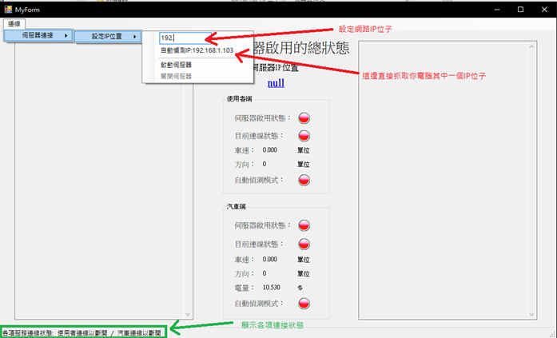
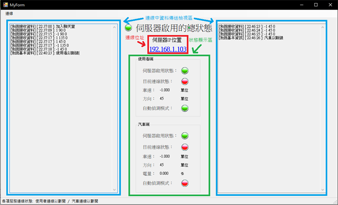
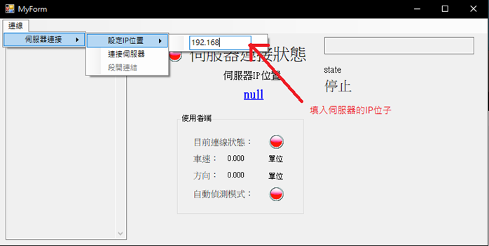

# 遠端控制駕駛車

## 功能簡介

建立一個伺服器來控管所連線的車子,再利用使用者端連線伺服器來對車子下達命令,車子可以透過指令的請求來執行前後左右的控制。

## 材料

| 名稱 | 備註 |
|------|------|
| 樹莓派 | Raspberry Pi 3B+ |
| 電源 | 電池盒、樹莓派電源供應模塊(含UPS) |
| 車體 | 兩段變速,轉向 |
| 開關 | |
| 可變電阻 | 調整電壓大小以控制馬達的扭力及速度 |
| 伺服馬達 | SG-90 |

## 硬體示意圖：

## 功能區塊圖：

## 功能介紹

### 伺服器

#### 簡介
提供汽車跟使用者的中控端,這個可以延伸往下做,只要將汽車連入後都加上編號,將他的連線資訊存檔,即可實現多台汽車的同時連線控制。

**製作負責人:** 鄭勝中

#### 遇到問題

1. **VC++ 2015 IP位址設定問題**
   - 2015年後規定不能使用 `sockaddr_in.sin_addr.s_addr = inet_addr("127.0.0.1")` 來設定IP位址
   - 必須改成使用 `inet_pton(AF_INET, "127.0.0.1", &sockaddr_in)` 來設定IP
   - 原因是因為有IPv6及IPv4的網路協定,微軟為了要區分差別所以強制要求程式設計師一定要使用函式來做轉換
   - 補充: AF_INET = IPv4, AF_INET6 = IPv6

2. **記憶體管理問題**
   - `gcnew` 此指令跟 `new` 的指令很像,我會用到是因為 VC++ 的 textbox 的文字存取式此用到一個叫做 `string^` 的變數
   - 需要透過 `gcnew string(放入一串字元陣列)` 來轉換
   - 會造成記憶體慢慢增加,導致無法正常控管記憶體的使用量
   - 利用 `GC::collect();` 來強制釋放未使用的記憶體給系統

#### 參考資料

- [用VC++寫CLR圖像界面](https://www.youtube.com/watch?v=nIpOR6FX4RA&t=204s)
- [C++ CLI 多執行緒的實作](https://awei791129.pixnet.net/blog/post/27855564-%5Bc%2B%2B-cli%5D-%E5%A4%9A%E5%9F%B7%E8%A1%8C%E7%B7%92%E7%9A%84%E5%AF%A6%E4%BD%9C-%E4%BD%BF%E7%94%A8-system%3A%3Athreading)
- [inet_ntop函數使用 (CSDN)](https://blog.csdn.net/eagle51/article/details/53157643)
- [inet_ntop/inet_pton函數使用](http://beej-zhtw.netdpi.net/09-man-manual/9-14-inet_ntop-inet_pton)
- [gcnew釋放問題](https://bbs.csdn.net/topics/220077286)

---

### 使用者介面

#### 簡介
製作出使用者介面,並使用IP位址連接伺服端,左側暫無顯示功能,右側顯示目前控制方向以及操控控制,藉由使用者介面將指令傳進伺服端,至終控制車輛前進。

**製作負責人:** 張凱傑

#### 遇到問題

我們在操作車子時希望可以使用複合鍵的方式實現前進轉彎跟倒退轉彎這樣的功能,一開始我以為使用VC的事件觸發就能輕易做到,發現好像要使用 `qkeyevent` 才能做到,而那需要使用另外一個叫做 Qt Creator 的 IDE 才能使用這個函式庫,礙於時間的關係,目前使用數字鍵代替方向。

#### 心得 (張凱傑)

這次製作專題我負責的是client端的程式和light sensor的製作,light sensor原本是為了要做距離感測的一個量測模組,但因為時間關係,來不及完成那部分的功能,程式的部分為了使我們的專題擁有使用者介面,我們這組選擇使用VC來製作server跟client端的程式,這對我來說是很大的技術障礙,因為我從來沒有打過VC,不過最終在同學的協助下還是讓這次的專題有了基本的功能,控制端跟server間傳輸的工具我們使用以前課堂上教的winsock來製作,相對來說簡單一些,不過在VC的打法上還是有些不同,總之這次的專題在程式編輯上我也有了很大的進步。

    

#### 參考資料

- [如何在單一事件中取得多個按鍵](https://stackoverflow.com/questions/7176951/how-to-get-multiple-key-presses-in-single-event)
- [QDemo之按鍵常按](https://my.oschina.net/jannn/blog/515291)

---

### 硬體端

#### 簡介
伺服端資訊傳送至硬體,藉由程式內的架構,包含WIFI連接、轉彎角度、馬達輸出,控制汽車轉向以及前進。

**製作負責人:** 黃培堯及張浩維

#### 遇到問題

1. **樹莓派WiFi連線問題**
   - 中後期發生了樹莓派無法使用WiFi連線的功能,且最後連WiFi Icon設定等都消失
   - 第一次想盡辦法,藉由網上的資料,從Driver到自己去文件檔打內容以及最下下策的重新安裝都試了一遍,WiFi仍然無法開啟或驅動
   - 最後只能使用USB無線網卡的硬體設備做排除
   - 中間有想過使用藍芽開藍芽網路分享,但考慮到短距離會無法連線的問題,最後退一步使用網卡

2. **Socket程式開發**
   - 在樹梅派上用C寫socket要使用Linux專用的標頭檔
   - 上網找到Linux要引入 `"sys/socket.h"`

3. **GPIO控制**
   - 要控制樹梅派的GPIO,找到使用C控制樹梅派GPIO的方法有 bcm2835 及 WiringPi 函式庫

4. **伺服馬達控制**
   - 伺服馬達所需要的頻率比使用WiringPi所控制的最低PWM頻率還來的低
   - 自己寫一個控制Digital GPIO高低電位來產生可調DC的PWM脈波

#### 參考資料

- [Socket教學](http://zake7749.github.io/2015/03/17/SocketProgramming/)
- [GPIO控制](https://coldnew.github.io/f7349436/)
- [樹莓派C語言控制](http://cheng-min-i-taiwan.blogspot.com/2013/04/raspberry-pi-c.html?m=1)
- [伺服馬達控制](https://blog.csdn.net/wu_lian_nan/article/details/72510395)

#### 其他相關資料

- [樹莓派3B+安裝Ubuntu Mate](https://www.youtube.com/watch?v=tdJrd75_068)
- [OpenCV影像處理 (1)](https://blog.csdn.net/huhongtao1989/article/details/79342280)
- [OpenCV影像處理 (2)](https://blog.csdn.net/u012201326/article/details/43937035)
- [OpenCV影像處理 (3)](https://blog.csdn.net/huhongtao1989/article/details/79342280)
